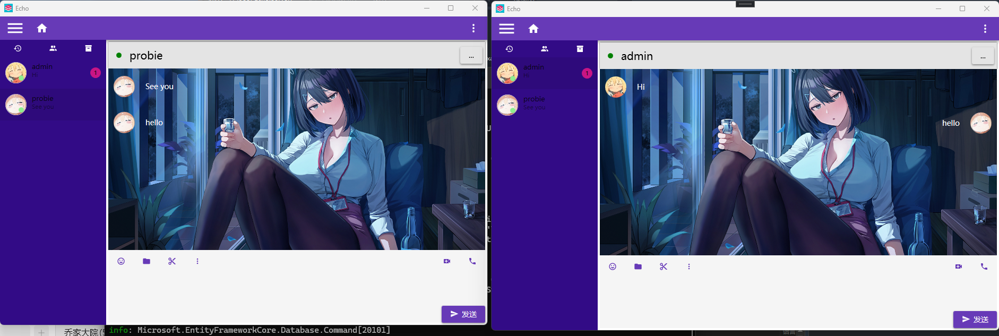
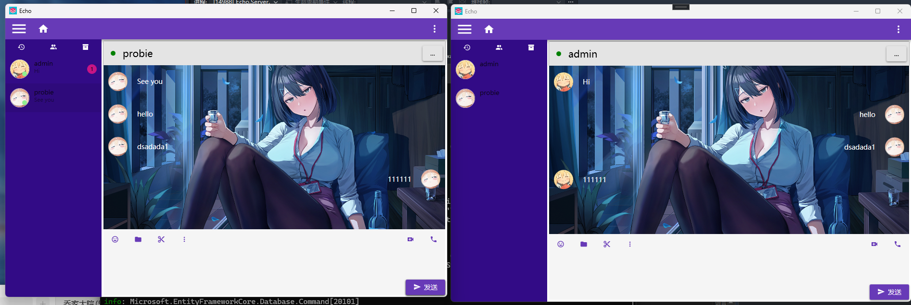
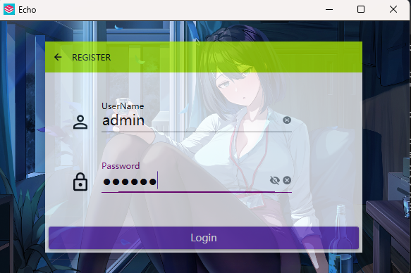
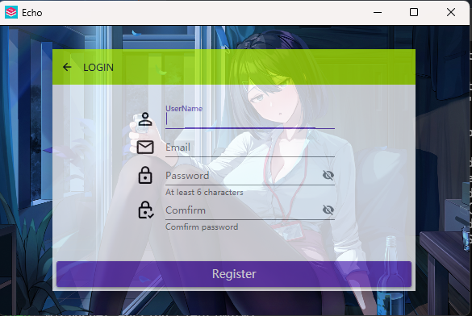

# Echo

简洁、现代的桌面聊天客户端（WPF）。本仓库为 Echo 应用的源码，包含聊天视图、联系人列表、登录页及对应的 ViewModel，实现了基础的聊天界面和消息展示逻辑。

## 主要特性
- 基于 WPF 的 MVVM 架构
- 最近会话列表、聊天内容区、联系人列表等模块化视图
- Prism 框架，便于维护和扩展
- 结构清晰，便于扩展（服务端、SignalR 等可集成）

## 技术栈
- .NET 8 / .NET 10（视具体项目文件而定）
- WPF，MVVM 模式，Prism 框架，依赖注入，SignalR

## 快速运行
先决条件：已安装 .NET SDK（建议 .NET 8 或 .NET 10）和 Visual Studio 2026。

1. 克隆仓库并切换到仓库根目录：

   git clone https://github.com/probieLuo/Echo.git
   cd Echo

2. 使用 Visual Studio 打开 `Echo.sln`，多项目启动（ `Echo`和`Echo.Server`）。

## 客户端截图

主界面

最近会话

登录界面

注册界面
